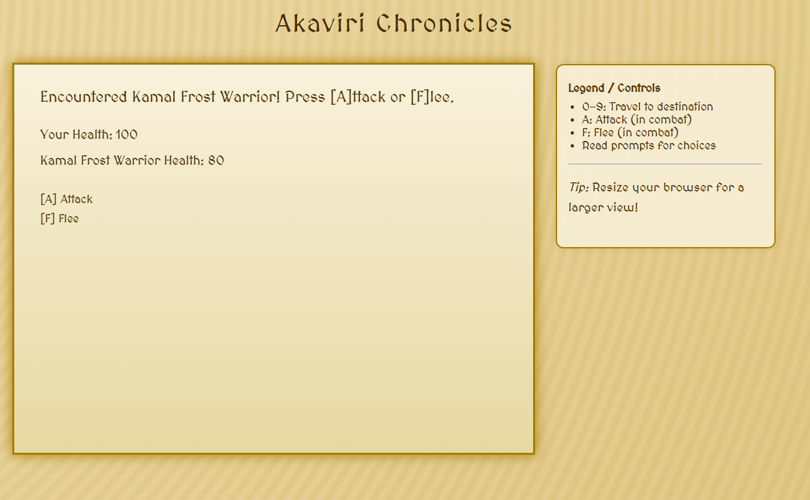

# Akaviri Chronicles

A browser-based, text-driven RPG adventure set in the mystical lands of Akavir. Explore ancient temples, battle fierce enemies, and embark on epic quests-all rendered on a beautiful parchment-style canvas.

[Play Akaviri Chronicles Now!](https://dp19420.github.io/project2JS-RPG/)

---

## Features

- **Exploration:** Travel through unique locations like the Po Tun Highlands, Frostwall Pass, and Lotus Valley.
- **Turn-Based Combat:** Face off against enemies with simple, responsive keyboard controls.
- **Quests:** Accept and complete quests to gain experience and level up.
- **Retro Visuals:** Enjoy a parchment-inspired interface with custom fonts and smooth text wrapping.

## Controls

| Key         | Action                                |
|-------------|---------------------------------------|
| 1-9         | Travel to connected locations         |
| 0           | Go back to previous location          |
| A           | Attack in combat                     |
| F           | Flee from combat                     |
| Y / N       | Respond to dialog choices            |
| R           | Restart the game after Game Over     |

## Getting Started

1. **Play Online:**  
   [Akaviri Chronicles - Live Game](https://dp19420.github.io/project2JS-RPG/)

2. **Or Run Locally:**
   - Clone this repository:
     ```
     git clone https://github.com/dp19420/project2JS-RPG
     ```
   - Open `index.html` in your browser.

## Project Structure

.
 - index.html # Main HTML file
 - game.js # Game logic and rendering
 - style.css # Optional custom styles
 - README.md # Project documentation

 ## Customization

- **Add Locations:** Edit the `gameState.locations` object in `game.js`.
- **Create New Quests:** Add to the `gameState.quests` object and expand the `checkQuest()` logic.
- **Enhance Combat:** Modify the `locationEncounters` and combat functions to add new enemies or abilities.

## Credits

- **Game Design & Code:** [dp19420](https://github.com/dp19420)
- **Font:** [MedievalSharp](https://fonts.google.com/specimen/MedievalSharp) (Google Fonts)
- **Inspiration:** The Elder Scrolls universe

## License

This project is free to use, modify, and distribute by anyone for any purpose.  
No permission or license from me is required.
---

## Screenshots

### Combat Screen


### Quest Started


### Starting Screen


## Testing

### HTML Validation (W3C)
")

### CSS Validation (W3C)
")

### JavaScript Lint (JSHint)


[View on GitHub](https://github.com/dp19420/project2JS-RPG)